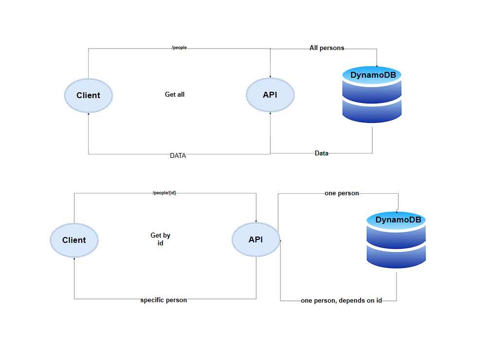
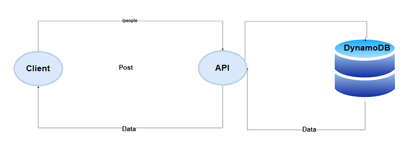
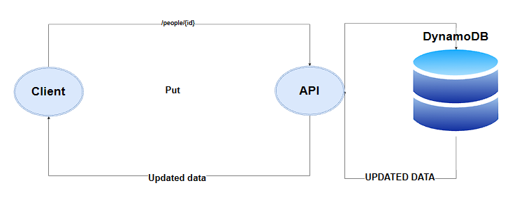
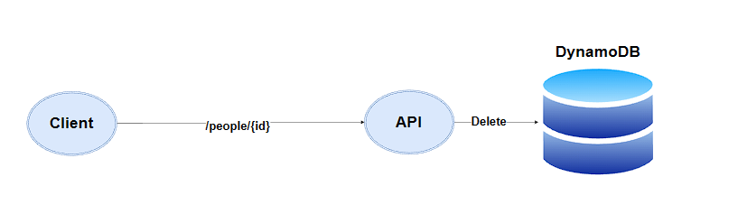

# serverless-api

----

**UML:**

* For get & get all:

* Post:

* Put:

* Delete:

----

**What is the root URL to your API?**

https://h7yhksyfkf.execute-api.us-east-1.amazonaws.com/people

----

**What are the routes?**

* post, /people: post new person
* get, /people/{id}: get one person
* get, /people: get all persons
* put, /people/{id}: update one person
* delete, /people/{id}: delete one person

----

**What output do they return?**

 * post: returns the new added object 
 * put: returns the updated object 

 * get all: returns the all the objects added (All persons)
* get by id: returns one object (one person, based on the id)
 * delete:  deletes the selected object and returns this message: 'Person deleted successfully'